# How to Use SAM2 Visual Object Tracking Tool

This guide provides a step-by-step walkthrough of the SAM2 Visual Object Tracking application workflow, from environment setup to result analysis.

### 1. Connect to WSL Environment
Open VS Code. In the remote window options, select **Connect to WSL** to ensure you are working in the correct Linux environment.
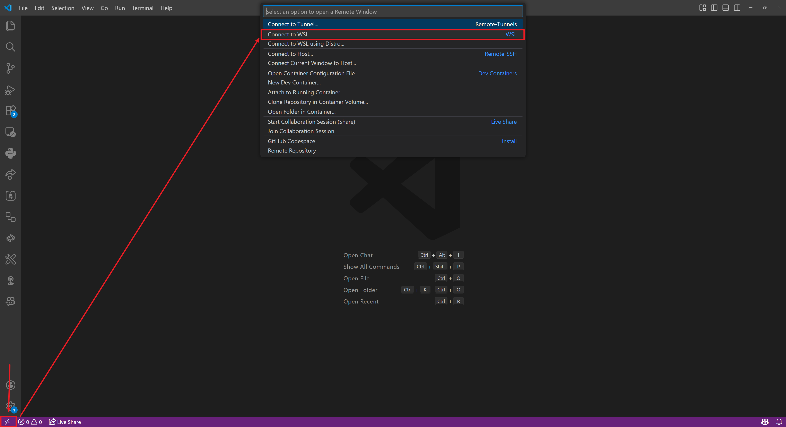

### 2. Open Project Directory
Open the file dialog and navigate to the project directory (e.g., `/home/ipd/Scripts/SAM2-Visualization/`), then click **OK** to open the folder.
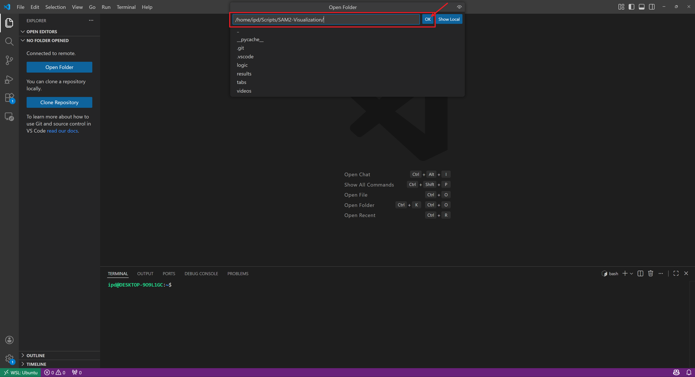

### 3. Configure Interpreter and Run Script
Open `app.py`. Ensure the correct Python interpreter is selected (e.g., `sam2` environment) from the dropdown menu, then click the **Run** button in the top right corner.
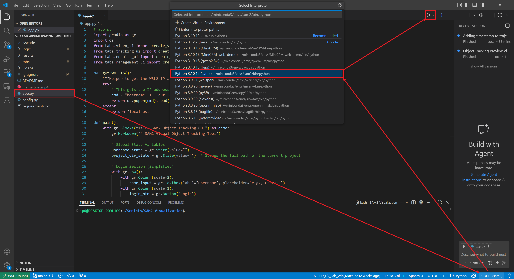

### 4. Launch the Web Interface
Once the script is running, a local URL (e.g., `http://172.26.182.53:7860`) will appear in the terminal. Ctrl + left-click this link to open the application in your browser.
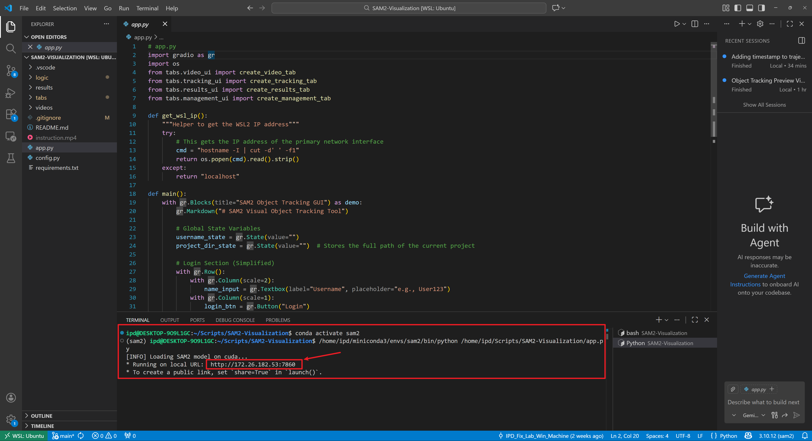
### 5. User Login
Enter your username in the designated field. It is important to remember this username as it is used for session management. Click **Login** to proceed.
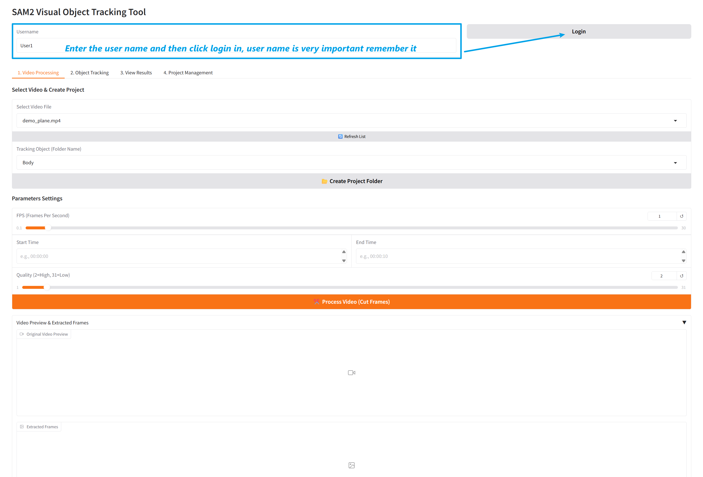

### 6. Interface Overview
The application dashboard is divided into four functional tabs. The default view is the **1. Video Processing** tab.
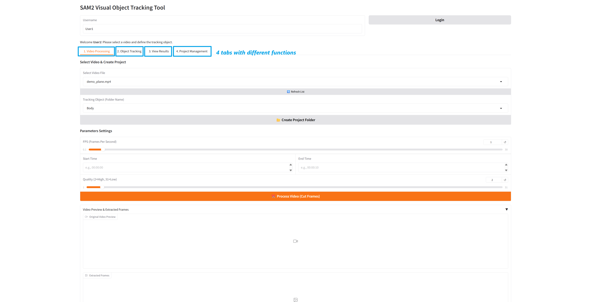

### 7. Configure Video Processing
In the "Video Processing" tab:
1.  Select the video file you wish to handle.
2.  Enter the name of the object you want to track.
3.  Click **Create Project Folder**.
4.  Adjust the slider parameters for FPS, start time, end time, and frame quality.
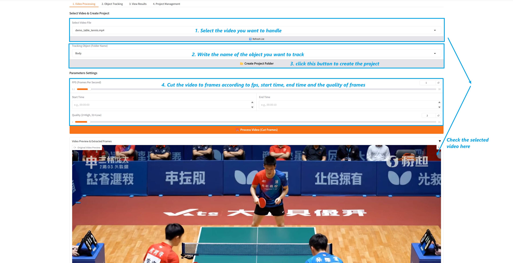

### 8. Confirm and Process
A confirmation window will appear showing your settings. Review the parameters for the project name, video, object, FPS, time, and quality. Click **Create & Process** to cut the frames.
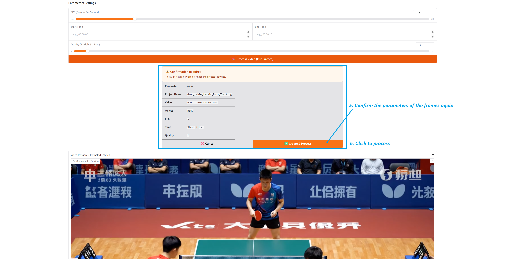

### 9. Review Extracted Frames
Once processed, the interface displays the original video and the extracted frames. You can navigate through the cut frames using the side panels or the filmstrip at the bottom.
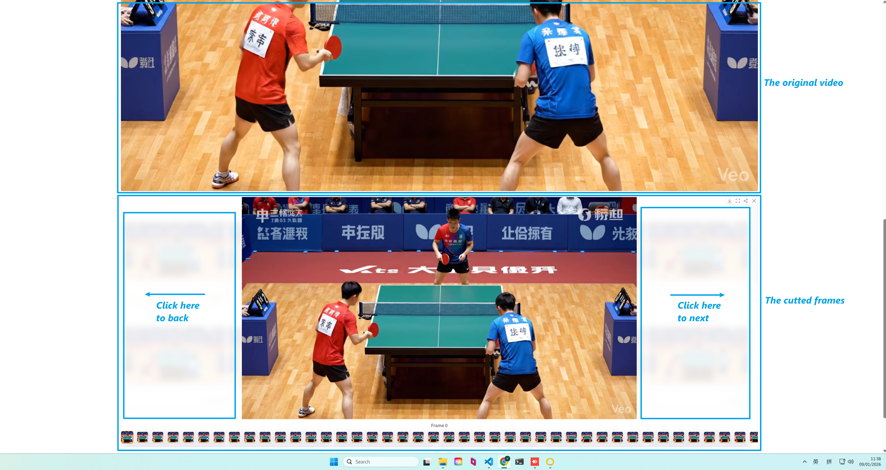

### 10. Select Project for Tracking
Navigate to the **2. Object Tracking** tab. Select the project created in the previous steps from the dropdown menu. This will load the first frame for interaction.
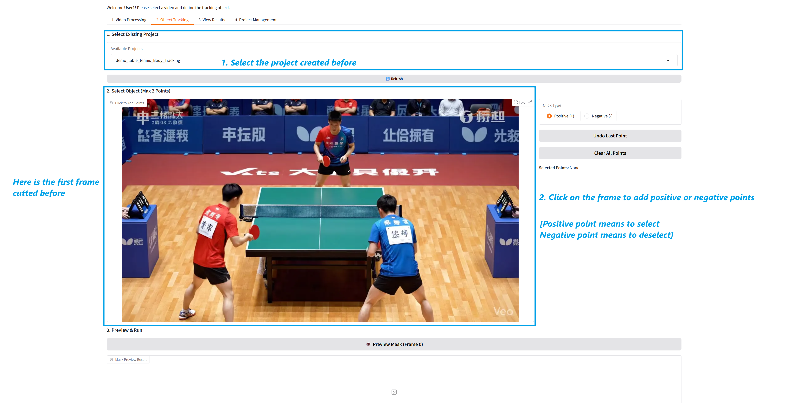

### 11. Define Tracking Points
Click on the frame image to add points. Left-click to add a **Positive point** (yellow) to select the object you want to track. You can also add negative points to deselect areas if needed.
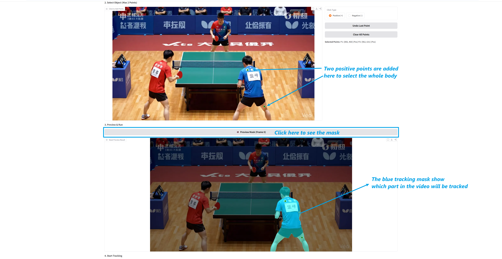

### 12. Preview Mask and Run Inference
Click **Preview Mask** to see a blue overlay indicating the tracking area. If the mask is accurate, click the orange **Start Tracking Inference** button. Monitor the Status Log at the bottom for progress.
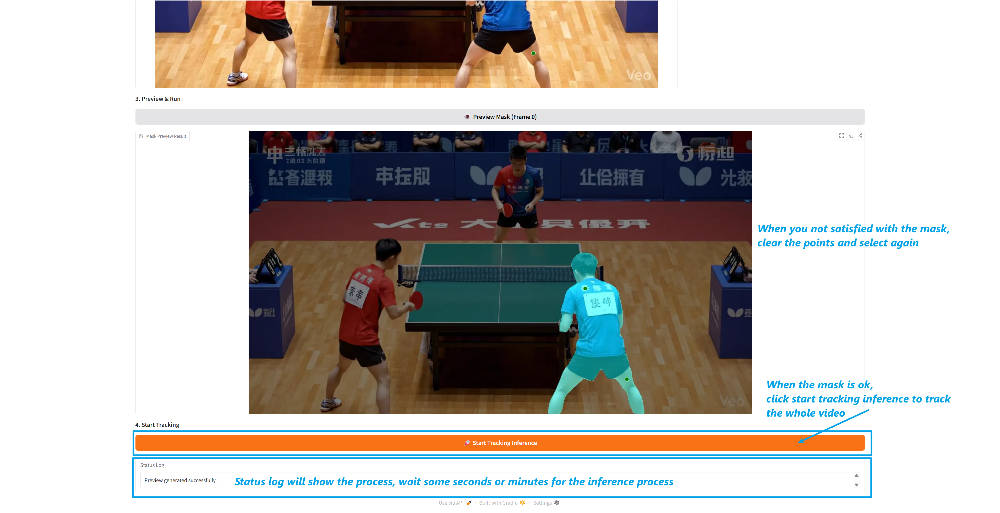

### 13. View Project Results
Navigate to the **3. View Results** tab. Select your project from the dropdown menu to load the project metadata and analysis data.
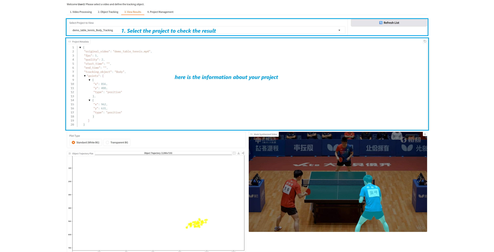

### 14. Trajectory Analysis and Downloads
The results tab displays the object's trajectory plot. You can toggle between a standard or transparent background and enable smoothing. Use the file list to download the trajectory CSV or result images.
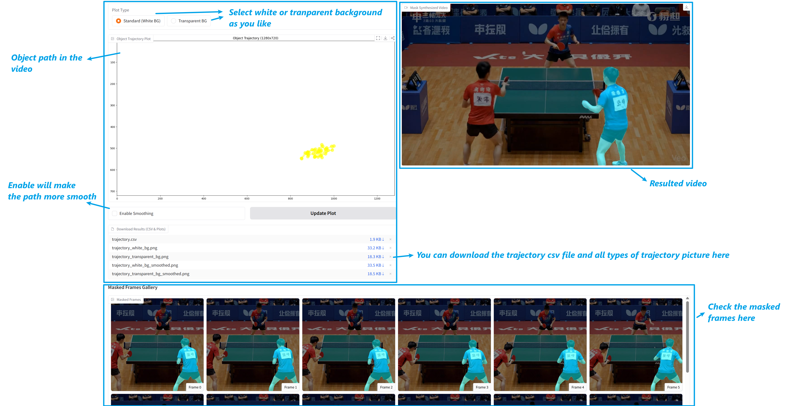

### 15. Review Visual Results
On the right side of the results tab, you can view the fully processed video with the tracking overlay. Below that, the "Masked Frames Gallery" allows you to inspect individual frames.

### 16. Project Management
Use the **4. Project Management** tab to organize your workspace. You can refresh the list or select a specific project and click **Delete Project** to remove it from the system.
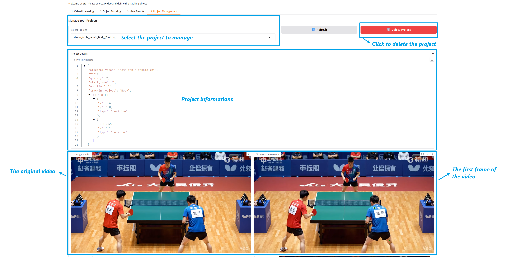
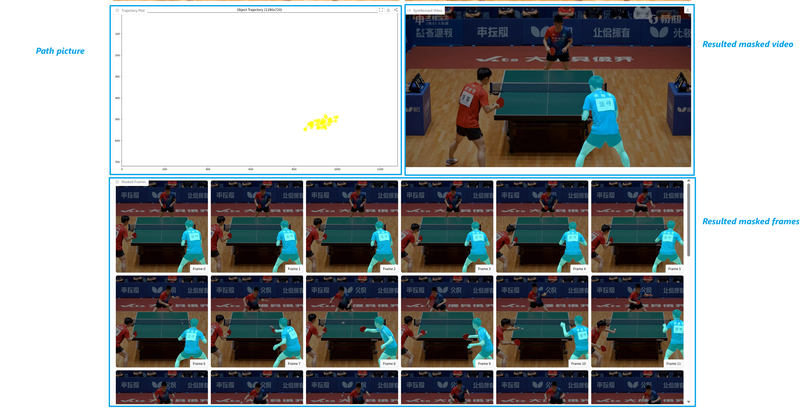
